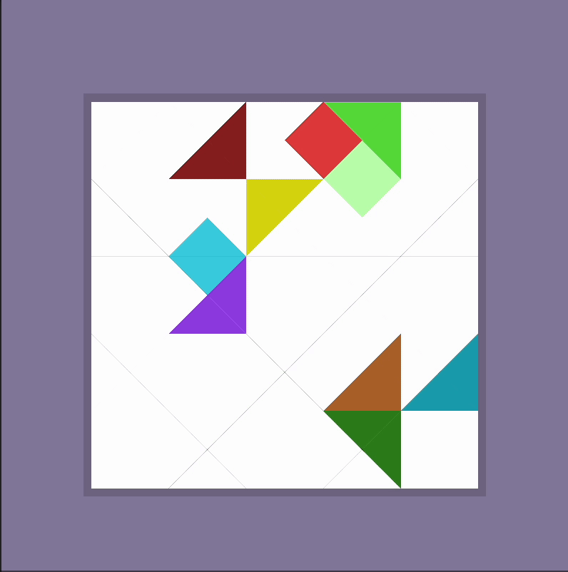

Oyun içerisi ayarlar için GameManager'da bulunan GameConfig Scriptable Objesine bakabilirsiniz.
Parça yaratılışını animasyon olarak oynatma ya da hazır levellar yerine kendi levellarınızı ayarlama gibi seçenekleri buradan bulabilirsiniz.

